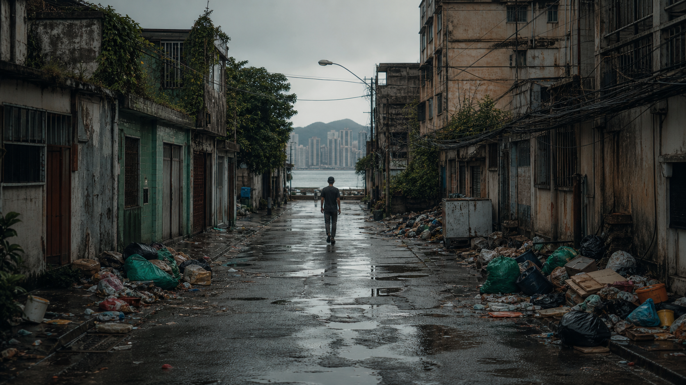

# 和煦暴风

*配乐：[《This Is Not Where We Are Supposed To Be》](https://music.163.com/#/song?id=1309897) —— 网易云音乐*

午间，漫步十四寸度假村，耳边回荡后摇"This Is Not Where We Are Supposed To Be"。

就让我堕落在这宁静午后吧：

哪怕污水遍地，垃圾横飞，戾气熏天。

刹那百感交集，却一心只想走完这段路。

如果有一天，如果是昨天或是将来：如果我的福祉不够沦为乞丐，我希望在无人的戈壁或海滩，大字平躺，享受片刻的烈阳，覆着和煦暴风，迎着片刻死亡，追着永生死亡。

如果还可以，我愿躺着摇椅，在塔顶，暴晒着，风吹着，望着，直至夕阳西下，直至漫天繁星，直至不知所以。

有限的和煦，有限的极限。
