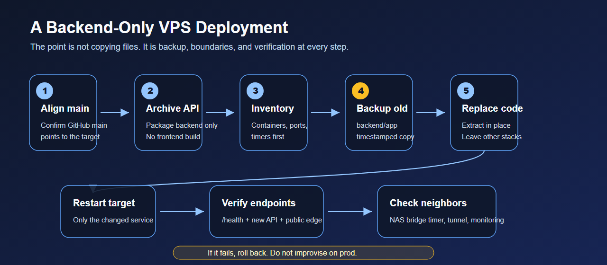

<!-- English is the default version. 中文原文见 index.zh.md（站内点「中文」按钮切换）。 -->

# Claude Account Suspended? A VPS Might Be the Answer


> **Short version:** A lot of people make Claude account stability sound more complicated than it needs to be. My preferred setup is simple: put Claude, code, browser sessions, and dev tools on one stable VPS. Local devices only connect to it through Tailscale, SSH, or RDP.

## TL;DR

| Problem | My approach |
| --- | --- |
| Too many devices and networks | Use one VPS as the fixed Claude work environment |
| Too much proxy-chain complexity | Use SSH-only if possible; add a lightweight Ubuntu desktop only if needed |
| Need the same setup across devices | Join everything with Tailscale |
| Need Claude Code, GUI tools, or a browser | Install them on the VPS, not every local machine |
| Account-safety anxiety | Reduce environment drift; do not claim immunity |

This is not a “never get suspended” promise. No account setup can honestly promise that. It solves a more practical problem: stop making your Claude usage look like a pile of random temporary sessions.

## 1. Most setups are overcomplicated

Many discussions around Claude stability quickly drift into complex exit chains, browser fingerprints, automation tricks, or “look more human” folklore.

I think that framing is often wrong.

If your real need is:

- stable Claude-assisted coding;
- the same environment from multiple devices;
- no repeated Node/Python/Docker/key setup on every laptop;
- less switching between home network, office network, phone hotspot, and random exits;
- less false-positive risk from environment drift;

then the direct answer is: **use a sufficiently capable VPS as your remote workstation.**

Your laptop is no longer the real work environment. It is just a terminal or remote display.

## 2. Pick a VPS that can actually be a workstation

For a small website, a tiny VPS is fine. For a Claude/dev/remote-desktop workstation, do not starve it.

My baseline:

- **CPU**: 2 vCPU minimum; 4 vCPU feels better.
- **RAM**: 2-4GB for SSH-only; 4-8GB for a lightweight desktop.
- **Disk**: 40GB minimum; 80GB+ if you keep projects, browser cache, and Docker images there.
- **OS**: Ubuntu 22.04 or 24.04 LTS.
- **Region**: choose one place you can use consistently.
- **Provider**: avoid suspiciously dirty IP pools or machines you need to replace constantly.

The point is not “one more IP.” The point is a fixed development seat.

## 3. Two modes: SSH-only or lightweight desktop

### Mode A: SSH-only

This is the simplest and cleanest mode.

```bash
sudo apt update
sudo apt install -y git curl vim tmux htop ufw
```

Then install whatever you actually need:

- Node.js / pnpm / npm
- Python / uv / pipx
- Docker / Docker Compose
- Claude Code or your CLI tools
- GitHub CLI

Daily use becomes:

```bash
ssh your-vps
tmux new -s work
```

Code, logs, scripts, and deployments all live in the same stable machine.

### Mode B: lightweight Ubuntu desktop

If you need a GUI, a browser, cc gui, or desktop-only tools, install a light desktop.

```bash
sudo apt update
sudo apt install -y xfce4 xfce4-goodies xrdp
sudo systemctl enable --now xrdp
```

Then connect through RDP. Do not start with a heavy desktop environment. XFCE is not glamorous, but it is light and predictable.

## 4. Tailscale makes the setup comfortable

Install Tailscale on the VPS and your local devices:

```bash
curl -fsSL https://tailscale.com/install.sh | sh
sudo tailscale up
```

Then:

- SSH through the Tailscale IP.
- Keep RDP private; do not expose it to the public internet.
- Put admin panels, internal health pages, and private services on the tailnet.
- Connect from laptop, desktop, phone, or tablet into the same work machine.

Now every local device is just a remote control. The actual Claude/browser/dev environment stays fixed.


## 5. Do not skip basic hardening

Create a normal user:

```bash
sudo adduser work
sudo usermod -aG sudo work
```

Use one SSH keypair per device:

```text
new machine private key stays on the new machine
new machine public key -> VPS ~/.ssh/authorized_keys
```

Do not copy one old private key everywhere.

Lock down the firewall:

```bash
sudo ufw default deny incoming
sudo ufw default allow outgoing
sudo ufw allow OpenSSH
sudo ufw enable
```

If RDP only needs to work over Tailscale, keep it private.

## 6. Deployment should still be boring

Even if the main point is the workstation, keep your VPS deployments repeatable.



Basic order:

1. Align the Git branch.
2. Update only the target directory.
3. Backup before replacing.
4. Restart the target service.
5. Verify `/health`, logs, and key endpoints.
6. Keep rollback possible.

Claude can help read logs and draft scripts, but production should not depend on improvisation.

## 7. About account safety

People want to ask: “Does this completely prevent suspension?”

No. That is not an honest claim.

Accounts are affected by Usage Policy, Terms, supported locations, payment, abuse detection, and false positives. No VPS setup creates immunity.

What this setup can reduce is one common risk: **environment drift**.

You stop jumping between networks, devices, proxy chains, and scripts. Your Claude workflow happens in one stable, auditable environment with logs, keys, backups, and recovery paths.

That is not evasion. It is normal engineering hygiene.

## 8. Checklist

- [ ] Buy a VPS with enough RAM.
- [ ] Install Ubuntu LTS.
- [ ] Create a normal user; do not live as root.
- [ ] Use one SSH keypair per device.
- [ ] Install Tailscale.
- [ ] Get SSH working first.
- [ ] Add XFCE + xrdp only if you need a GUI.
- [ ] Keep RDP on Tailscale, not the public internet.
- [ ] Install Claude Code / cc gui / browser / dev tools on the VPS.
- [ ] Write deployment runbooks with backup, verification, and rollback.

## 9. Final thought

Do not turn Claude environment stability into folklore.

Most of the time, you do not need more evasion tricks. You need one clean, fixed, recoverable remote workstation.

VPS + Tailscale + SSH/RDP is boring. That is exactly why it works.
