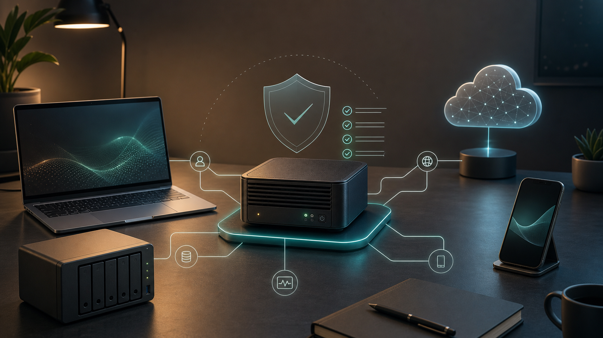
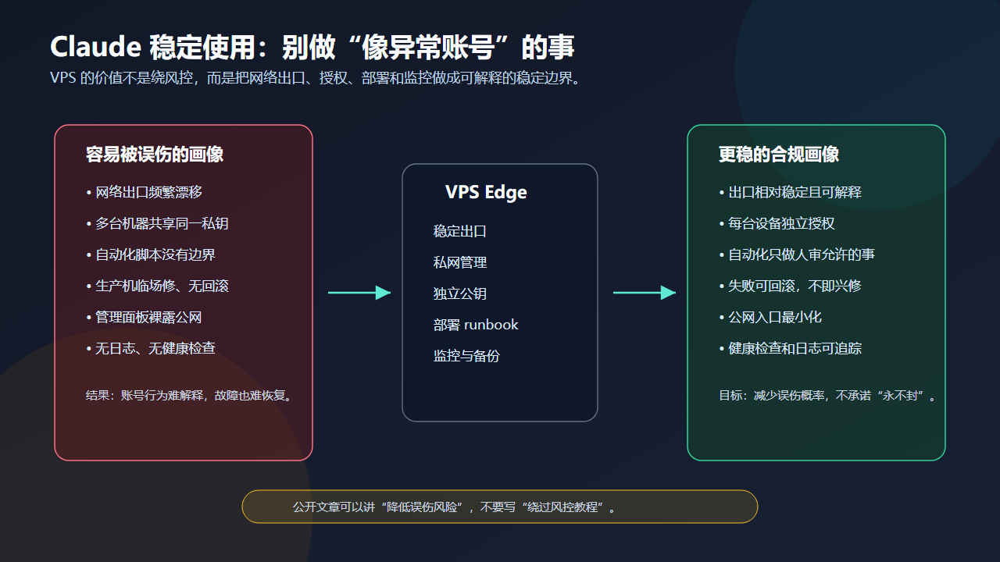
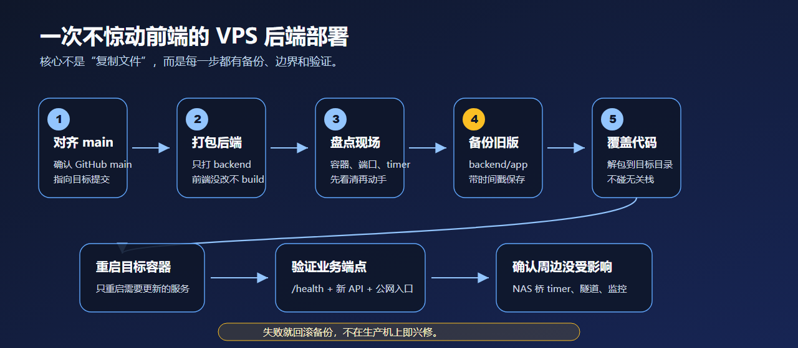

<!-- 中文版。English: index.md（站内点语言按钮切换）。 -->

# Claude 封号？VPS 或许才是终极答案



> **一句话：** Claude 账号稳不稳这件事，很多人想得太复杂了。我的办法挺土的——拿一台配置够用的 VPS，把 Claude、代码、浏览器、常用工具全装在上面，本地设备只当遥控器，用 Tailscale / SSH / RDP 连进去。

## 先说结论

| 你遇到的情况 | 我的做法 |
| --- | --- |
| 好几台设备、好几个网络来回切 | 只用一台 VPS 当 Claude 的工作机 |
| 懒得折腾复杂代理链 | 能 SSH 就 SSH，要界面就装个轻量 Ubuntu 桌面 |
| 想在所有设备上用同一套环境 | 拉个 Tailscale，电脑、平板、手机都直连 |
| 要用 Claude Code / cc gui / 浏览器 | 全装在 VPS 上，不在每台机器重复配 |
| 怕账号行为忽上忽下 | 入口、设备、工作流都稳定下来，少踩误判 |

我不敢保证这样就永远不封号，没有哪种做法能这么打包票。它能帮上的地方其实很普通：让你用 Claude 的路径别再像一堆随手开的临时会话那样飘。

---

## 1. 我觉得大家都整复杂了

一聊 Claude 稳定性，很多人张口就是一长串：好几个机场、不同出口、换浏览器指纹、上自动化脚本、各种“让自己更像真人”的小技巧。

我越来越觉得这条路容易走歪。

其实大部分人的真实需求就这么几条：

- 能稳定地用 Claude 写代码；
- 换设备也能接着上同一套环境；
- 不想每台电脑都重装一遍 Node、Python、Docker、SSH key；
- 不想今天家里网、明天公司网、后天手机热点地折腾；
- 别因为环境忽东忽西被误伤。

要满足这些，最省事的其实是：**搞一台配置够用的 VPS，当自己的远程工作机。**

这么一来，本地那台电脑就不用干重活了，它只负责连上去。我在 Mac 上连、在 Windows 上连、在 iPad 上连，进去都是同一套环境。对 Claude 那边来说，请求来源也稳定，不会今天冒个新出口、明天又换台设备。



我不是要伪装成真人、也不是想躲检测，纯粹是不想给自己留一堆解释不清的变量——今天换节点、明天换机器、后天加脚本，真出问题了自己都排查不动。

## 2. VPS 怎么选

如果只是挂个博客、跑俩小服务，便宜小鸡够用。但你要拿它当 Claude / 开发 / 远程桌面的主力机，配置就别抠。

我一般这么配：

- **CPU**：至少 2 vCPU，宽裕点就 4 vCPU。
- **内存**：只 SSH 的话 2–4GB 够；要跑轻量桌面，上 4–8GB。
- **硬盘**：至少 40GB；要放项目、浏览器缓存、Docker 镜像，直接 80GB 起。
- **系统**：Ubuntu 22.04 或 24.04 LTS。
- **地区**：挑一个你会长期用的，别三天两头换。
- **商家**：别贪便宜用那种 IP 池脏、频繁换机、来路不明的。

买它不是图多一个 IP，是给自己省下每次重搭环境的功夫，顺带有个稳定的 SSH 入口。

## 3. 两种装法：纯 SSH 或轻量桌面

### 方案 A：纯 SSH

最简单，也最稳。

先把基础工具装上：

```bash
sudo apt update
sudo apt install -y git curl vim tmux htop ufw
```

再按需要装：

- Node.js / pnpm / npm
- Python / uv / pipx
- Docker / Docker Compose
- Claude Code 或你惯用的 CLI
- GitHub CLI

平时就是：

```bash
ssh your-vps
tmux new -s work
```

代码、日志、部署、脚本都在这台机器上跑完。

纯 SSH 的好处是清爽：不用装桌面，没有图形层要维护，暴露面也小。你需要的无非是稳定的 SSH 和一套固定密钥。

### 方案 B：轻量 Ubuntu 桌面

如果你确实想要图形界面，或者要跑浏览器、cc gui、某些非 GUI 不可的工具，那就装个轻量桌面：

```bash
sudo apt update
sudo apt install -y xfce4 xfce4-goodies xrdp
sudo systemctl enable --now xrdp
```

然后装上浏览器、编辑器和 Claude 相关工具，本地 RDP 连进去，这台 VPS 就成了一台远程开发桌面。

别一上来就上 GNOME 那种重桌面，XFCE 足够了。这机器不图好看，能稳定跑、占用低、坏了好重装就行。

## 4. Tailscale 直连，真香

让这套方案用起来舒服的关键是 Tailscale。

把 VPS 和所有本地设备拉进同一个 tailnet：

```bash
curl -fsSL https://tailscale.com/install.sh | sh
sudo tailscale up
```

然后：

- SSH 走 Tailscale IP。
- RDP 只绑私网，不上公网。
- 管理面板、健康检查页、内部服务只给 tailnet 看。
- 手机、平板、公司电脑、家里电脑，连的都是同一台机器。

这样 3389 就不用挂公网了，各种管理入口也不必对全世界开着。用起来也简单：手上的设备都只是遥控器，真正干活的 Claude、浏览器、开发环境全在 VPS 上。


## 5. 基础安全别省

这套东西不复杂，但基础安全该做还得做。

先开个普通用户，别老拿 root 用：

```bash
sudo adduser work
sudo usermod -aG sudo work
```

每台设备各自生成 SSH key，只把公钥加到 VPS：

```text
新机器私钥留在新机器
新机器公钥 -> VPS ~/.ssh/authorized_keys
```

别偷懒把同一把私钥拷到所有机器上，那等于一处丢了、全线沦陷。

再收紧防火墙：

```bash
sudo ufw default deny incoming
sudo ufw default allow outgoing
sudo ufw allow OpenSSH
sudo ufw enable
```

RDP 既然走 Tailscale，就别再往公网开。能走私网就走私网，能少开端口就少开。

## 6. 部署别靠临场发挥

这篇主要不是讲部署，不过顺带提一句：VPS 上的项目，最好写个固定的部署 runbook。



最基本的顺序无非是：

1. 本地和 VPS 上对齐 Git 分支。
2. 只更新要动的目录。
3. 更新前先备份旧版本。
4. 重启目标服务。
5. 验证 `/health`、日志和关键接口。
6. 出事能回滚。

这跟 Claude 也有关系。你可以让它帮你看日志、写脚本、理步骤，但生产流程本身不能靠临场发挥——流程越固定，AI 越好搭手；流程一乱，它只会把乱摊子放得更大。

## 7. 关于“封号”：别写死承诺

我知道大家最关心的还是那句：这样是不是就不封了？

得说清楚：**不能保证。**

平台账号受 Usage Policy、服务条款、地区支持、支付、异常检测、误判一堆因素影响。谁要是拍胸脯说“彻底杜绝封号”，那是不负责任，也不适合公开写。

但这套做法确实能压掉一类常见风险——环境忽东忽西。

你不用再换网络、换设备、换代理、换脚本地折腾，Claude 的活都落在同一台 VPS 上：有日志能查，有备份能回，密钥边界也清楚。说白了不是钻空子，就是把自己用工具的方式收拾得正常点。

## 8. 照着抄的清单

你要也想这么搭，我会按这个顺序来：

- [ ] 买一台配置够用的 VPS，内存别抠。
- [ ] 装 Ubuntu LTS。
- [ ] 开个普通用户，别长期用 root。
- [ ] 每台设备单独 SSH key，只追加公钥。
- [ ] 装 Tailscale，把 VPS 和本地设备放进同一个 tailnet。
- [ ] 先把 SSH 跑通。
- [ ] 需要图形界面再装 XFCE + xrdp。
- [ ] RDP 只走 Tailscale，别裸公网。
- [ ] Claude Code / cc gui / 浏览器 / 开发工具都装在 VPS 上。
- [ ] 部署写成 runbook，有备份、有验证、能回滚。

## 9. 最后

这篇文章想说的其实就一句：

> 别把 Claude 环境稳定这事搞成玄学。多数时候你缺的不是更花哨的规避技巧，而是一台能远程连、坏了能重来的固定机器。

VPS + Tailscale + SSH/RDP 这套组合不新也不酷，但够朴素、够稳。在账号这件事上，稳定、能自己讲清楚，比各种花活靠谱多了。
