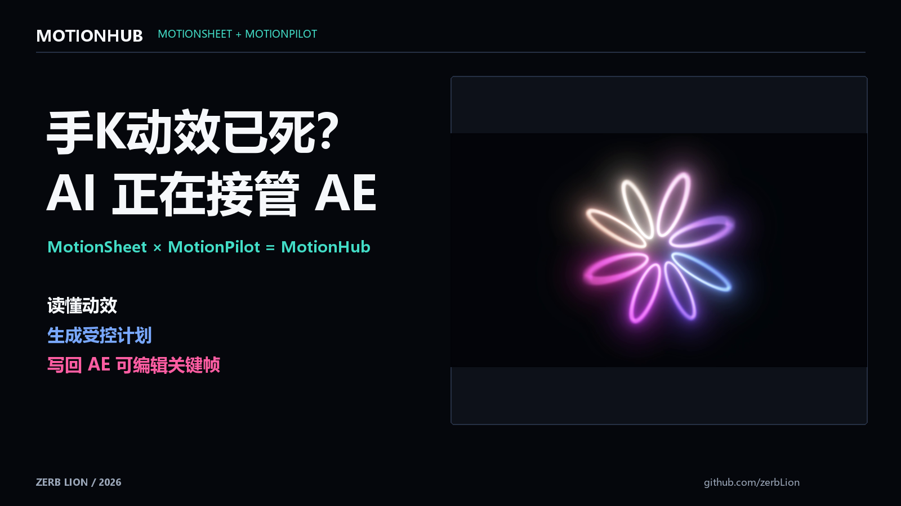
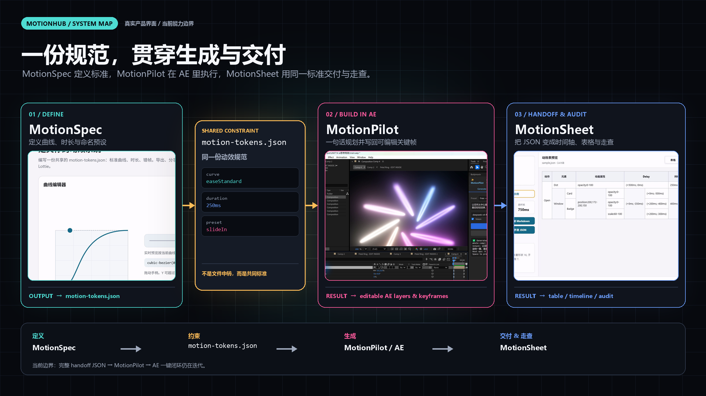
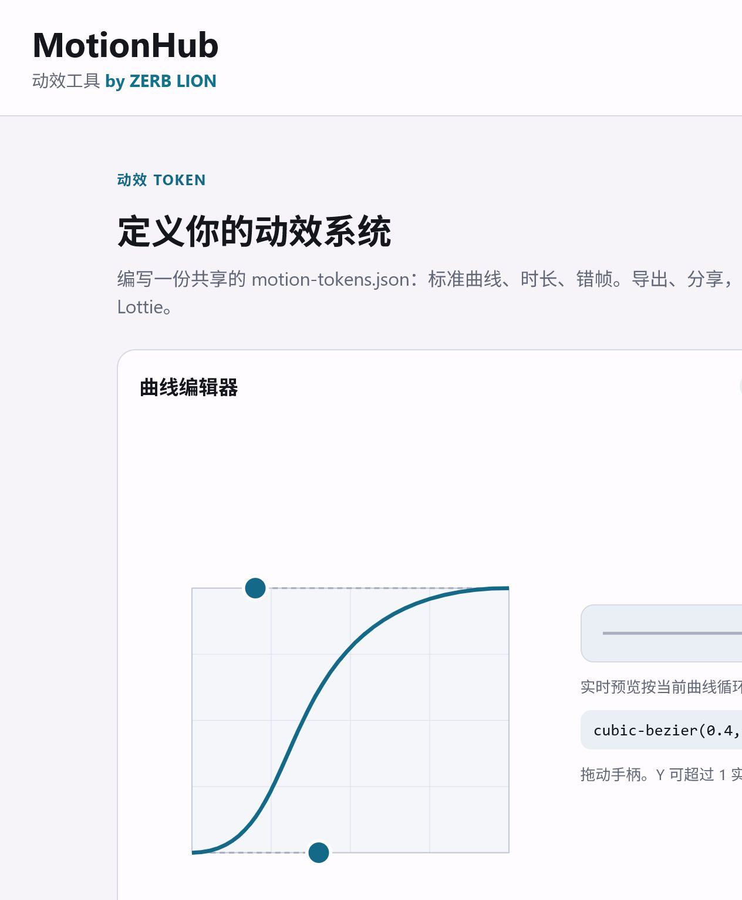
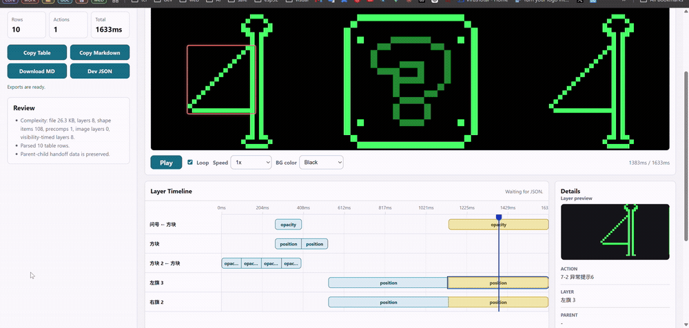
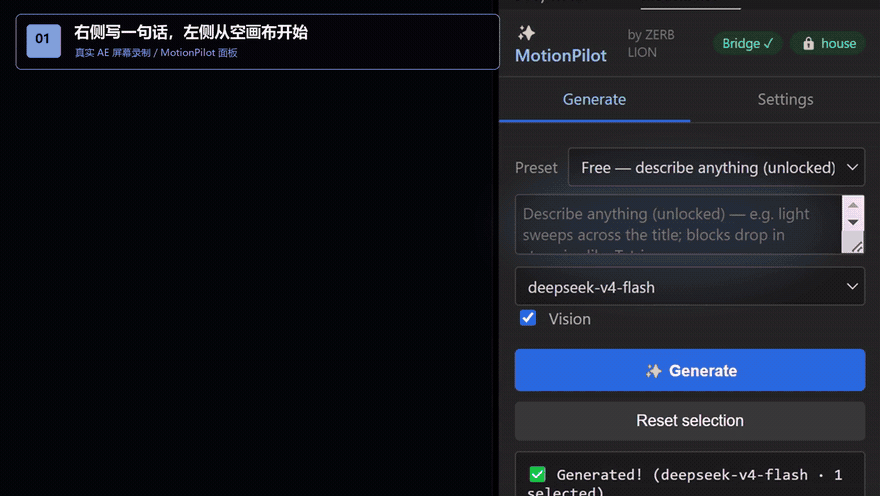

# AI Is Entering the Editable Motion Pipeline

<video controls playsinline preload="metadata" poster="cover.png">
  <source src="motionhub-demo.mp4" type="video/mp4">
</video>

> **In one sentence:** MotionSpec defines the rules, MotionPilot writes intent into After Effects, and MotionSheet hands off and audits against the same spec. Together, they form MotionHub.

The headline is aggressive; the claim is deliberately narrower. AI has not replaced a motion designer's taste, but it is moving beyond "help me keyframe this" and into an editable, constrained, auditable production pipeline.

The goal is not another black-box generated clip. Structure, planning, and the result all stay inside a normal design workflow.

| Part | Job | Output |
| --- | --- | --- |
| MotionSpec | Define curves, durations, and named presets | Shared `motion-tokens.json` |
| MotionPilot | Plan and execute motion in AE | Editable layers, keyframes, effects, and expressions |
| MotionSheet | Read Lottie / Bodymovin data | Timeline, handoff table, and spec audit |
| MotionHub | Connect definition, execution, and audit | One shared motion workflow |

## MotionSpec: encode the rules

MotionSpec turns a house motion style from scattered documentation and personal habit into a shared `motion-tokens.json`. Curves, durations, and named presets are edited visually, then read by both MotionPilot and MotionSheet.

## MotionSheet: read motion

MotionSheet runs in the browser and reads JSON locally. It turns animation data into a developer-readable table, adds timeline inspection, and keeps parent-child motion visible instead of flattening it into a vague duration.

## MotionPilot: write motion

MotionPilot lives inside After Effects. It combines selected-layer context, optional visual context, an LLM-generated plan, and deterministic JSX execution. The result remains editable in AE; it is not a rendered black-box clip.

The demo is a real After Effects screen recording. A motion description is entered in MotionPilot on the right and Generate is clicked; the composition and timeline on the left then receive actual layers and editable keyframes. Only the API wait is visibly time-compressed. Generation and playback remain at their recorded speed, followed by the real MotionSheet interface inspecting and handing off motion data. A second JSON example then moves between timeline, layer details, and table view to show that the workflow is not hard-coded to one animation.

## Why the plugin is the important part

Without MotionPilot, an AI can still produce a one-off JSX script. But every new effect risks rebuilding layer lookup, AE API calls, JSON transport, permissions, undo handling, and error reporting. A script that runs once is not the same as a capability that can be reused reliably.

| Without the plugin | With MotionPilot |
| --- | --- |
| Start each effect from another JSX file | Solve scene I/O, execution, feedback, and undo once |
| Ask the LLM to guess intent and AE internals | Let the LLM interpret; let a deterministic executor apply |
| Debug failures across scripts, AE, and transport | Trace failures to a command and layer |
| Finish once, then rewrite next time | Add a motion primitive once and reuse it |

The plugin is not merely a shortcut. It is shared infrastructure for AI to operate After Effects, keeping the fragile engineering stable while people and models focus on timing, hierarchy, and taste.

## Why I plan to open-source it under MIT

The exciting part is compounding capability. One contributor can add a keyframe strategy, another an effect or expression, and another a test project or failure case. Every person and every AI can then reuse that vocabulary.

I plan to release the first-party plugin code under MIT and keep iterating on the execution contract, motion strategies, aesthetic constraints, and safe rollback. **The repository has not completed its license transition yet, so this is the plan, not a claim that the conversion is already done.** Third-party code will retain its original notices and licenses.

The destination is not “generate this one flower.” It is an extensible loop:

> Send an image, GIF, or video -> AI decomposes structure and timing -> MotionPilot writes editable AE -> a human refines it

Today, MotionHub cannot promise that every motion reference will work on the first try. But every reliable execution primitive means the next attempt no longer starts from zero.

## What works now, and what comes next

All three parts have a working page or prototype. MotionSpec edits and exports the shared spec. MotionSheet can inspect and export motion handoff data. MotionPilot can read an AE scene, generate a plan, execute supported operations, and return to the normal AE editing workflow. The launch video uses the real MotionPilot panel and AE result, with clearly labeled time compression during API waits and two real MotionSheet JSON walkthroughs.

The honest boundary: **the suite is not yet a one-click closed loop.** The next milestone is the full handoff import bridge, so MotionSheet output can become MotionPilot input while staying constrained by the same `motion-tokens.json`, without re-describing timing, easing, hierarchy, or layer intent.

That is what MotionHub means to me:

> Designers can explain motion. Developers can reproduce it. After Effects can execute it.

## Try the projects

- [MotionSheet live demo](https://zerb.cc.cd/)
- [MotionPilot page](https://zerb.cc.cd/pilot)
- [MotionSheet on GitHub](https://github.com/zerbLion/keyframe_sheet)
- [MotionPilot on GitHub](https://github.com/zerbLion/motion-design)

The vertical social demo, real AE source clip, and platform-ready copy are included with this post's source assets.
