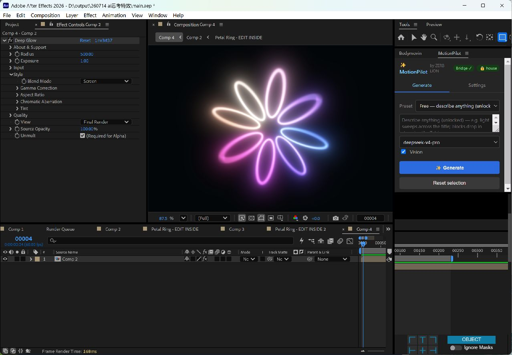

# MotionHub: Motion Specs Meet After Effects

<video controls playsinline preload="metadata" poster="cover.png">
  <source src="motionhub-demo.mp4" type="video/mp4">
</video>

> **In one sentence:** MotionSheet explains existing motion; MotionPilot turns new intent into editable work inside After Effects.

MotionHub is not a third app. It is the name for the workflow that connects two projects I was already building.

| Part | Job | Output |
| --- | --- | --- |
| MotionSheet | Read Lottie / Bodymovin data | Layers, timing, curves, hierarchy, handoff table |
| MotionPilot | Plan and execute motion in AE | Editable layers, keyframes, effects, and expressions |
| MotionHub | Connect both directions | A shared motion contract from analysis to execution |

## MotionSheet: read motion

MotionSheet runs in the browser and reads JSON locally. It turns animation data into a developer-readable table, adds timeline inspection, and keeps parent-child motion visible instead of flattening it into a vague duration.

## MotionPilot: write motion

MotionPilot lives inside After Effects. It combines selected-layer context, optional visual context, an LLM-generated plan, and deterministic JSX execution. The result remains editable in AE; it is not a rendered black-box clip.

## What works now, and what comes next

Both ends already work as prototypes. MotionSheet can inspect and export motion handoff data. MotionPilot can read an AE scene, generate a plan, execute supported operations, and return to the normal AE editing workflow.

The honest boundary: **the two products are not yet a one-click closed loop.** The next milestone is a shared motion contract so MotionSheet output can become MotionPilot input without re-describing timing, easing, hierarchy, or layer intent.

That is what MotionHub means to me:

> Designers can explain motion. Developers can reproduce it. After Effects can execute it.

## Try the projects

- [MotionSheet live demo](https://zerb.cc.cd/)
- [MotionSheet on GitHub](https://github.com/zerbLion/keyframe_sheet)
- [MotionPilot on GitHub](https://github.com/zerbLion/motion-design)

The vertical social demo and platform-ready copy are included with this post's source assets.
