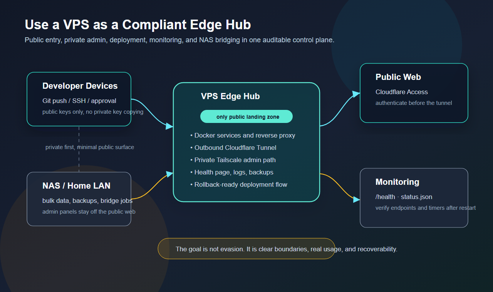

# I Turned Homepage into My Personal Command Center

> **In one sentence:** I started with a page of useful links. It grew into the first screen I check every day—whether the machines are healthy, which route I should use, and how much Claude or Codex time is left.

This is not a concept mockup assembled for a launch post. It is a real snapshot of Zerb Hub running in production.

I originally built the page on top of the open-source [Homepage](https://github.com/gethomepage/homepage) project. As the number of services grew, a collection of bookmarks stopped being enough. A link could open a service, but it could not tell me whether that service was healthy. One service might have public, home-LAN, and Tailscale routes. My VPS, NAS, media stack, and AI tools each had their own status page.

I did not need more cards. I needed a first screen that answered the questions I actually ask.

## It did not begin as a design exercise

Zerb Hub was pushed into shape by daily use.

| The question I ask | What the first screen should answer |
| --- | --- |
| Is the VPS healthy? | CPU, memory, disk, load, traffic, and uptime |
| Is the NAS running hot? | CPU, board, and drive temperatures |
| Is a service down? | Live latency and a few application-level stats |
| Which route should I use? | WAN, LAN, and Tailscale entry points |
| How long can I keep working in Claude or Codex? | Usage windows and reset countdowns |
| Will another device have the same setup? | Synced layout, bookmarks, and background state |

That changed how I think about a home page. It should not rebuild every system behind it. It should put the information worth seeing at a glance next to the real entry point.

## First, the honest attribution: I did not rewrite Homepage

Homepage already provides a mature application-dashboard foundation: YAML configuration, service cards, bookmarks, weather, themes, and a large catalog of integrations. It is licensed under GPL-3.0, and those capabilities belong clearly to the upstream project.

My work sits mostly in the layer above and around it:

- composing the VPS, NAS, AI, social, and everyday tools into one view;
- merging several network routes into one service card;
- adding custom CSS and JavaScript interactions;
- syncing personal bookmarks, layout, and backgrounds across devices;
- aggregating host metrics and sanitized AI-usage data;
- connecting the page, containers, tunnel, and access controls into a recoverable production path.

It is more than a reskin, but it is not a from-scratch replacement. The accurate description is: **I let a mature open-source base grow into my own workflow.**

## Live state belongs next to the entry point

I used to open separate dashboards for the VPS, NAS, media services, and uptime checks. Each page offered complete information, but most of the time I only wanted a tiny answer: healthy, or worth investigating?

Zerb Hub compresses that into two levels:

- The first level answers “do I need to care?” with utilization, temperature, latency, uptime, and connection counts.
- The second level opens the original service for logs, configuration, and detailed metrics.

The benefit is not merely saving clicks. It makes anomalies visible. A service that is usually green and suddenly becomes slow is easier to notice beside its entry point than inside a dashboard I may not open.

I deliberately did not move every management action into the Hub. It is primarily a read-oriented front door. Changes, deployments, and operational work stay in their own systems. The closer a dashboard gets to infrastructure, the more conservative its write surface should be.

## One service card, three real routes

In a self-hosted environment, one service often has more than one address:

- a public entry point protected by access control;
- a direct route on the home LAN;
- a Tailscale route when a suitable public path is unavailable.

The naive solution is to duplicate the service three times. With enough services, the home page becomes a different kind of clutter.

I instead placed WAN, LAN, and TAIL as segmented routes inside one service card. A service with only one valid path does not pretend to have a route selector; its path is stated directly in the title. The page models one service, while the routes remain ways to reach it.

The diagram above came from an earlier social write-up of my VPS edge pattern. Zerb Hub follows the same boundary: public access crosses identity checks, private administration prefers Tailscale, and the NAS keeps its own storage and bridge responsibilities. The page unifies entry points without collapsing every network role into one opaque path.

## The important part of an AI-usage card is the credential boundary

I use Claude and Codex throughout the day. The metric that changes my working rhythm is not a lifetime token count; it is how much remains in the current usage window and when that window resets.

So the Hub gained two usage cards for short and weekly windows.

That looks like a few extra numbers. The important design decision behind them is this: **the browser must never receive the CLI OAuth credentials.**

Collectors run locally on the VPS and write only allow-listed percentages, window durations, and reset times into sanitized caches. The Homepage backend reads those fields, and the page only renders them. Authentication directories are not mounted into the web container, and access or refresh tokens do not enter frontend code or logs.

If a provider does not return a window, the UI shows `--`. Missing data is more trustworthy than a complete-looking number inferred from the wrong source.

## It became mine when state followed me across devices

At first, layout, favorites, and backgrounds lived in the browser. That immediately created a practical problem: the home page I organized on one computer returned to its defaults on my phone or remote desktop.

`localStorage` is convenient, but it is not a cross-device source of truth.

I added a small personal synchronization API that keeps these items on the VPS:

- personal bookmarks;
- service-card and bookmark order;
- favorite backgrounds;
- the active background;
- layout changes after every drag-and-drop operation.

The layout exposed another subtle failure. I initially stored groups as positional IDs such as `g0`, `g1`, and `g2`. Inserting a new group shifted every group after it and scrambled saved layouts. The current version derives stable IDs from group names, so adding content no longer invalidates the user's arrangement.

## A background image can become a state machine

The daily background began as a scheduled replacement of `bg.jpg`. Real use quickly added natural requirements: save a good image, reject a bad one immediately, upload my own, rotate favorites, and keep the result consistent on every device.

That work produced two useful lessons.

First, **successfully fetching a new image does not mean an already-open page will display it.** A single-page app may continue using the cached response for the same URL, so the frontend also checks the file timestamp and only switches automatically while the user is still in daily-background mode.

Second, **atomically replacing a file does not guarantee that a container's single-file bind mount follows it.** The new file can have a new inode while the container continues to see the old one. Mounting the image directory read-only lets the service observe the atomically replaced file.

What looked like decoration became a small state machine once it had to be synchronized, favorited, rejected, and recoverable.

## Five conclusions I kept from the build

### 1. Documentation is not runtime truth

Git, containers, and Cloudflare Tunnel routes can drift independently. A deployment is not complete when the README looks right or the container is green. I need to verify the code revision, local ports, effective ingress, and public access control together.

### 2. A successful `GET` does not validate the write path

A health endpoint and static assets can work while bookmark, layout, or background updates fail. Proxy rewriting, caching, and route precedence can affect `POST` requests alone. Read and write paths need separate checks.

### 3. Missing live data is safer than invented live data

The dangerous failure mode of a monitoring dashboard is not a blank field. It is a plausible number assembled from the wrong source. Temperatures, limits, and service state all need explicit provenance.

### 4. Cross-device state cannot live only in the browser

If this is “my home page” rather than “this browser's home page,” layout, bookmarks, and favorites need a server-side source of truth. Browser storage can only be a cache.

### 5. The home page should not become a new monolith

Zerb Hub does not replace the NAS, media servers, deployment tools, or AI platforms. It organizes their entry points, state, and routes. Each system keeps its own permissions and failure boundary, preventing the Hub from becoming a new single point of risk.

## Why the repository is still private

The system is a strong fit for me, but it is not yet something another person should copy as-is. It contains assumptions tied to one personal infrastructure: service names, domain structure, routes, container composition, monitoring sources, and access policy.

I would rather publish the method and the lessons than package private infrastructure configuration as “ready to use.”

If I prepare a public edition, I will first extract the reusable pieces: multi-route service cards, stable layout IDs, sanitized usage collectors, cross-device state synchronization, and least-privilege deployment examples. Homepage's GPL-3.0 license and attribution will remain explicit.

## When does a start page become an operations dashboard?

My answer: when it stops merely telling you where to go and begins reliably answering whether things are healthy, which path to take, and whether something needs attention.

Zerb Hub did not reduce the number of systems I own. It put the most important first sentence from each system in one place.

Now, when I open a browser, I do not see a wall of bookmarks. I see whether my digital life is operating normally today.
