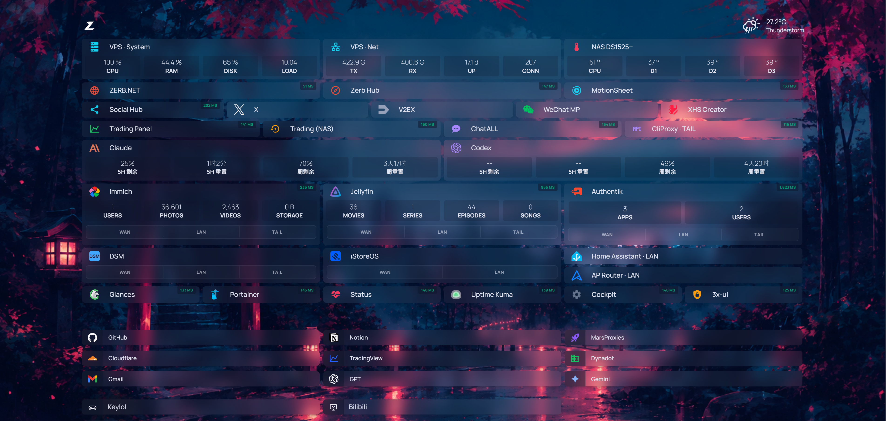
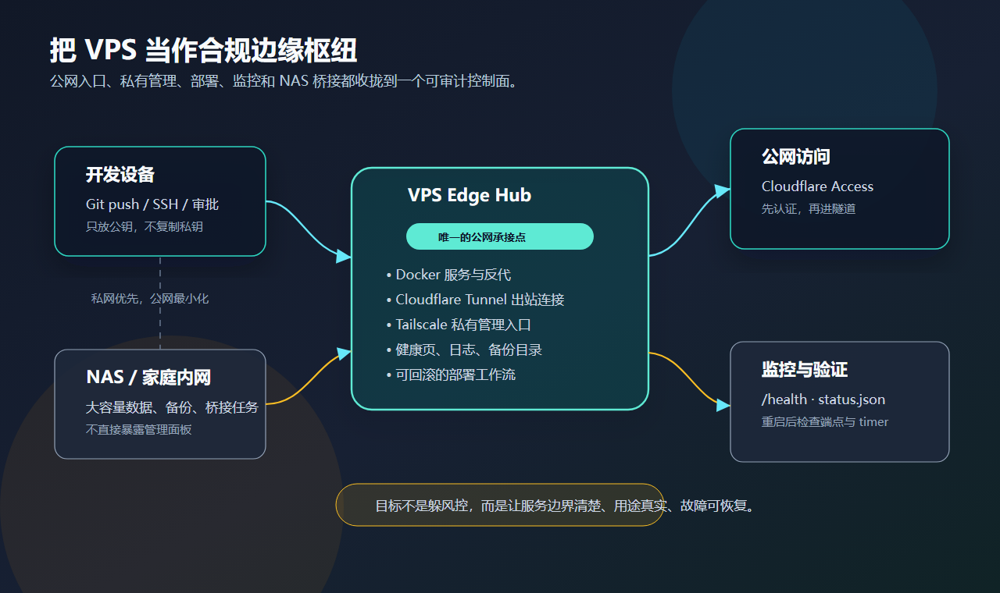

<!-- 中文版。English: index.md（站内点语言按钮切换）。 -->

# 我把 Homepage 改成了自己的数字驾驶舱

> **一句话：** 我原本只想做一页常用链接，最后却做成了一块每天真正会看的工作台——机器是否正常、服务该走哪条路径、AI 额度还剩多少，都能在打开浏览器的第一眼看见。

这张图不是概念稿，也不是为了发文章临时拼出来的界面。它是 Zerb Hub 当时正在运行的生产页面。

我最初用开源项目 [Homepage](https://github.com/gethomepage/homepage) 搭了一个主页。服务越来越多以后，单纯的“链接收藏”很快就不够用了：一个入口能打开服务，却不能告诉我服务是否正常；同一个服务可能有公网、家庭局域网和 Tailscale 三条路径；VPS、NAS、AI 工具又各有一套状态页。

我真正需要的，不是更多卡片，而是一个能回答日常问题的第一屏。

## 它不是从一张设计稿开始的

Zerb Hub 是被真实使用一点点推出来的。

| 我每天会问的问题 | 首页应该直接给出的答案 |
| --- | --- |
| VPS 今天正常吗？ | CPU、内存、磁盘、负载、流量和在线时长 |
| NAS 有没有过热？ | CPU、主板与硬盘温度 |
| 服务是不是挂了？ | 实时延迟与应用自身的统计 |
| 现在该从哪里进去？ | WAN、LAN、Tailscale 三条真实路径 |
| Claude / Codex 还能用多久？ | 当前额度窗口与重置倒计时 |
| 换台设备以后还要重新整理吗？ | 同步后的布局、书签和背景状态 |

这也改变了我对“主页”的理解。主页不是把所有系统重新做一遍，而是把最值得第一眼看到的信息，放在真正的入口旁边。

## 先承认：我没有从零重写

Homepage 已经提供了成熟的应用仪表盘底座：YAML 配置、服务卡片、书签、天气、主题和大量服务集成。它使用 GPL-3.0 许可证，这些基础能力都应该清楚归功于上游。

我的工作主要发生在另一层：

- 重新编排 VPS、NAS、AI、社媒与日常工具；
- 把一个服务的多条访问路径合进同一张卡片；
- 增加自定义 CSS / JavaScript 交互；
- 做跨设备书签、布局与背景同步；
- 聚合本机指标与脱敏后的 AI 额度；
- 把页面、容器、隧道和访问控制接成一套可恢复的生产链路。

这不是“换了一套皮肤”，也不是“从零造了一个 Homepage”。更准确的说法是：**我把一个成熟的开源底座，长成了自己的工作流。**

## 实时状态必须出现在入口旁边

过去我会分别打开 VPS 监控、NAS 面板、媒体服务后台和状态页。每个页面都能给出完整信息，但我要的往往只是一个很小的答案：正常，还是需要处理？

所以 Zerb Hub 把信息压到两个层级：

- 第一层只回答“要不要管”：资源占用、温度、延迟、在线时长、连接数。
- 第二层才进入原服务，继续看日志、配置和详细统计。

这样做的好处不是少点几次鼠标，而是把异常变得显眼。一个平时稳定在绿色的服务突然变慢，比藏在独立后台里的曲线更容易被注意到。

但我没有把所有管理能力都塞进首页。Hub 主要是只读入口；真正的修改、部署和运维仍回到各自系统。一个控制台越接近基础设施，越应该克制它能写什么。

## 一张卡片，收住三条访问路径

自托管环境里，同一个服务经常不止一个地址：

- 在外面，用受访问控制保护的公网入口；
- 在家里，走局域网；
- 没有合适公网链路时，走 Tailscale。

最笨的做法是把一个服务复制成三张卡片。服务一多，首页很快又变成另一种混乱。

我最后把 WAN、LAN、TAIL 做成同一张服务卡里的分段入口。只有一条路径的服务不会硬画一个“选择器”，而是直接在标题里标清路径。页面展示的是“一个服务”，路径只是进入它的方式。

上图是我之前在 social 里整理过的 VPS 边缘枢纽思路。Zerb Hub 沿用了同一条边界：公网访问先经过身份验证，私有管理优先走 Tailscale，NAS 保留自己的数据与桥接职责。页面只是统一入口，不把所有网络能力揉成一条不可解释的链。

## AI 额度卡最重要的不是“显示”，而是凭据边界

我每天同时使用 Claude 和 Codex。真正影响工作节奏的不是“今天用了多少 token”，而是当前额度窗口还剩多少、什么时候重置。

于是 Hub 里多了两张额度卡，展示短周期与周周期的剩余比例和倒计时。

这件事看起来只是多几个数字，背后最重要的设计却是：**浏览器永远不应该拿到 CLI 的 OAuth 凭据。**

额度采集在 VPS 本机完成，只把白名单里的比例、时间窗口和重置时间写成脱敏缓存。Homepage 后端读取这些字段，页面只负责显示。认证目录不挂进网页容器，access token、refresh token 也不会写进前端或日志。

如果上游暂时没有返回某个窗口，页面就显示 `--`。缺数据就承认缺数据，比根据另一个窗口猜一个“看起来完整”的数字可靠得多。

## 跨设备同步以后，主页才真的属于我

一开始，布局、收藏和背景都存在浏览器本地。很快就出现一个很现实的问题：电脑上整理好的首页，换到手机或远程桌面以后又回到默认状态。

`localStorage` 很方便，但它不是跨设备的事实来源。

我后来给 Hub 加了一个很小的个人同步 API，把这些状态保存在 VPS：

- 自己添加的书签；
- 服务卡与书签的顺序；
- 收藏的背景；
- 当前正在使用的背景；
- 编辑模式下每次拖放后的布局。

布局还有一个容易忽略的坑。早期我按 `g0 / g1 / g2` 这类数组位置保存分组，一旦在前面插入新分组，后面的卡片就会整体错位。现在改为根据分组名称生成稳定 ID，新增内容不再把旧布局推翻。

## 一张背景图，也能长出一套状态机

每日背景最初只是定时替换一张 `bg.jpg`。真正使用以后，需求很自然地冒出来：喜欢的要收藏，不喜欢的要马上消失，自己的图要能上传，收藏要能轮换，而且换设备以后还得保持一致。

这个过程中我踩了两个很典型的坑。

第一个坑是：**抓图成功，不等于已经打开的页面会换图。** 单页应用可能继续使用同一个 URL 的缓存，所以前端还要检查更新时间，并只在用户仍处于“每日背景”模式时自动换图。

第二个坑是：**原子替换文件，不等于容器里的单文件挂载会跟着换。** 新文件可能已经是另一个 inode，而容器仍然看着旧文件。最后我改成只读挂载整个图片目录，让原子替换后的新文件能被服务立即读取。

一张背景图看似是装饰，真正做成跨设备、可收藏、可拒绝、可恢复的功能以后，它已经是一套小型状态机。

## 做完以后，我留下了五条判断

### 1. 文档不是运行时事实

Git、容器和 Cloudflare Tunnel 的路由都可能各自漂移。部署完成不能只看 README，也不能只看“容器是绿色的”；必须同时核对代码版本、本地端口、实际 ingress 和公网访问控制。

### 2. `GET 200` 不代表写入链路正常

健康检查和静态资源正常，只能证明读路径可用。书签、布局和背景同步依赖写请求，代理的路径改写、缓存或路由优先级可能只影响 `POST`。读写要分别验收。

### 3. 实时数字宁可缺失，也不要伪造

监控面板最危险的不是少一个数字，而是展示一个看起来合理、其实由错误来源拼出的数字。温度、额度和服务状态都应该保留来源边界。

### 4. 跨设备状态不能只放浏览器

如果它是“我的主页”而不是“这台浏览器的主页”，布局、书签和收藏就必须有服务器端事实来源。浏览器存储最多只能做缓存。

### 5. 首页不是新的单体应用

Zerb Hub 不负责替代 NAS、媒体服务、部署工具或 AI 平台。它负责把入口、状态和路径组织好。每个系统继续保持自己的权限与故障边界，Hub 才不会成为新的单点风险。

## 为什么仓库暂时还是私有的

这套东西已经很适合我，但还不适合直接让别人照抄。里面包含大量和个人基础设施绑定的假设：服务命名、域名结构、网络路径、容器编排、监控来源和访问策略。

我愿意公开的是方法和踩坑，而不是把私人基础设施配置包装成“开箱即用”。

如果以后整理公开版本，我会先把可复用的部分抽出来：多路径卡片、稳定布局 ID、脱敏额度采集、跨设备状态同步，以及对应的最小权限部署示例。上游 Homepage 的 GPL-3.0 许可证与署名也会继续保留清楚。

## 从什么时候起，主页变成了运维面板？

我的答案是：当它不再只告诉你“去哪里”，而开始可靠地回答“现在是否正常、该走哪条路、要不要处理”，它就已经不只是导航页了。

Zerb Hub 没有让我少拥有几个系统。它只是把那些系统最重要的第一句话，放到了同一个地方。

现在我打开浏览器，先看到的不是一排书签，而是自己这套数字生活今天是否运转正常。
